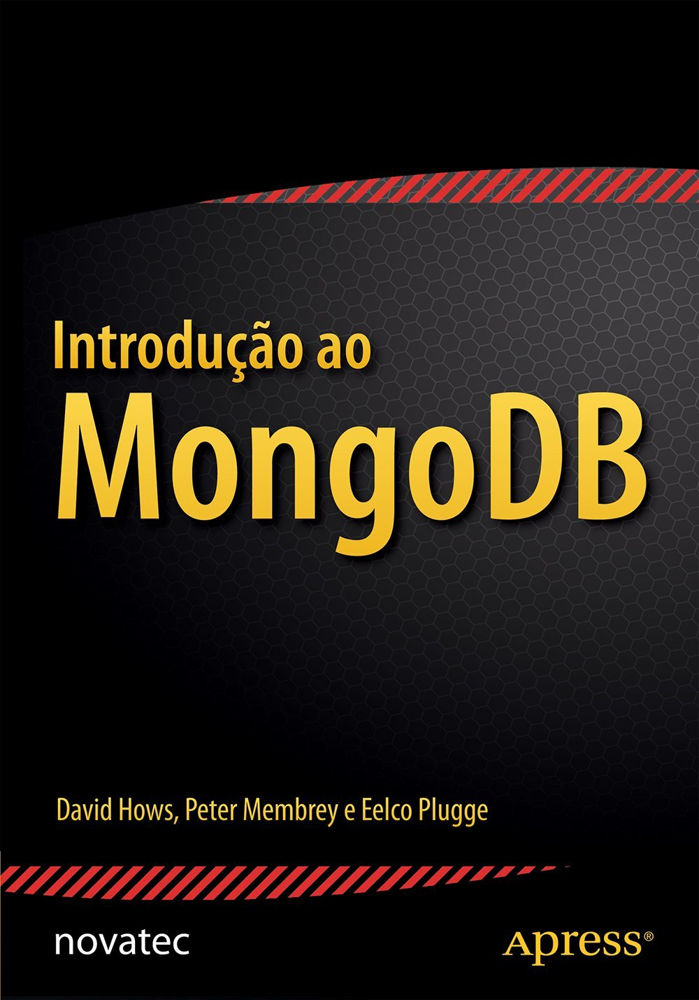

# book-mongodb

Estudos sobre o banco de dados NoSQL MongoDB do livro "Introdução ao MongoDB" por David Hows, Peter Membrey e Eelco Plugge (Novatec).
Copyright 2015 Novatec, 978-85-7522-422-9.

O site para compra do livro: [Amazon](https://www.amazon.com.br/Introdu%C3%A7%C3%A3o-ao-Mongodb-David-Hows/dp/8575224220/ref=sr_1_3?__mk_pt_BR=%C3%85M%C3%85%C5%BD%C3%95%C3%91&crid=2G1N1801Q6HZM&keywords=mongodb&qid=1647138990&sprefix=mongodb%2Caps%2C153&sr=8-3)

Todos os arquivos foram baseados no livro citado.

## Conteúdos

1. Introdução ao MongoDB
2. Instalando o MongoDB
3. O modelo de dados
4. Trabalhando com dados
5. GridFS

## Outros

Veja também o repositório [course-database](https://github.com/thiagoneye/course-database/).
